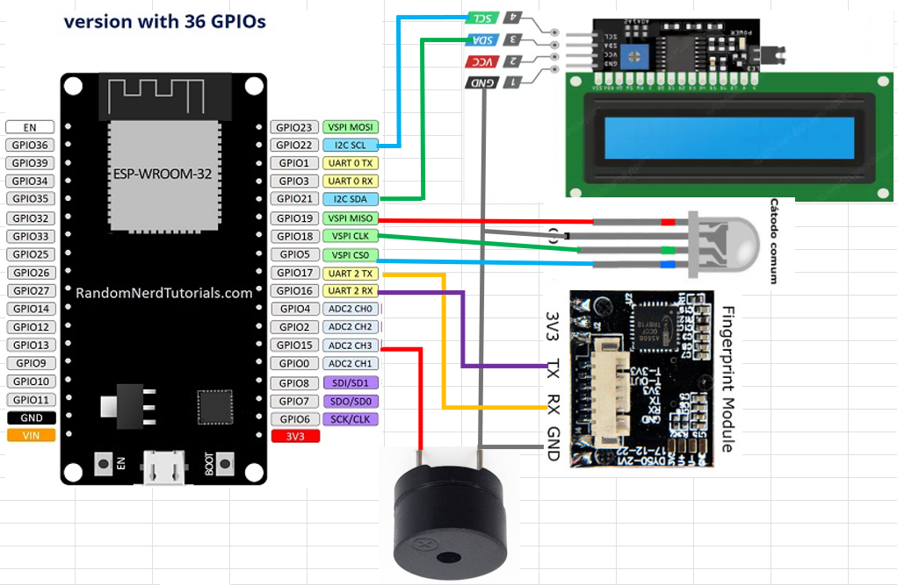
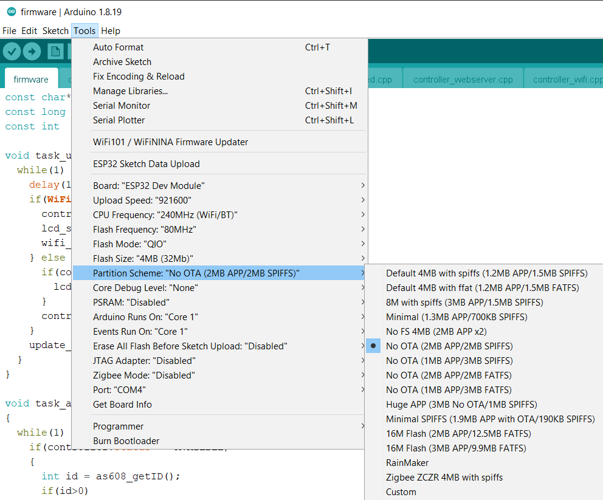
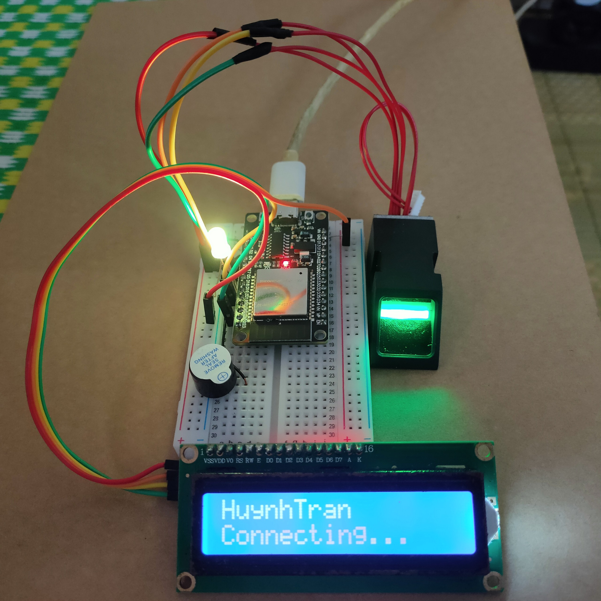
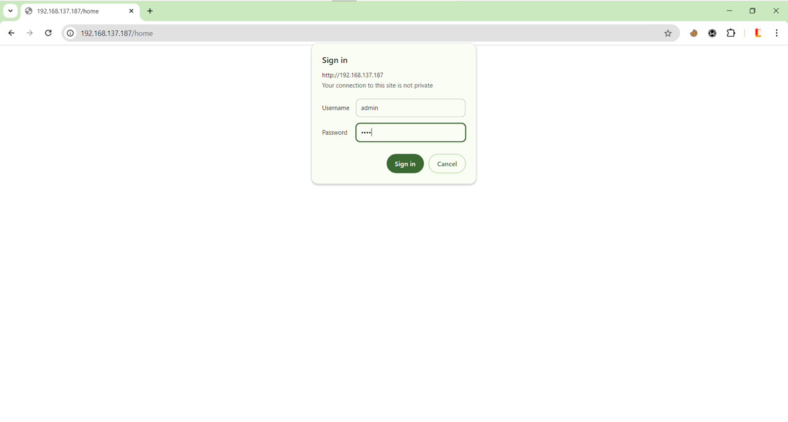
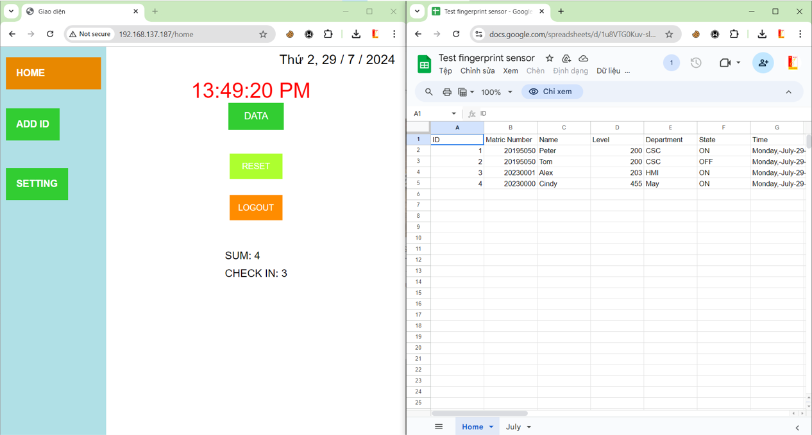
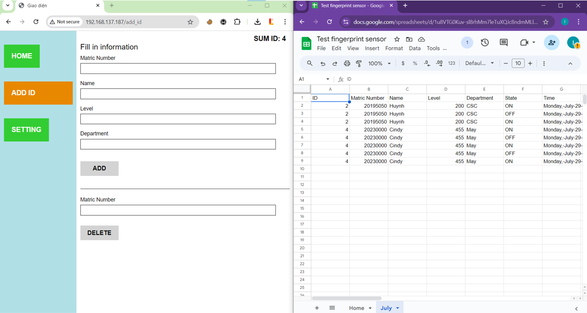
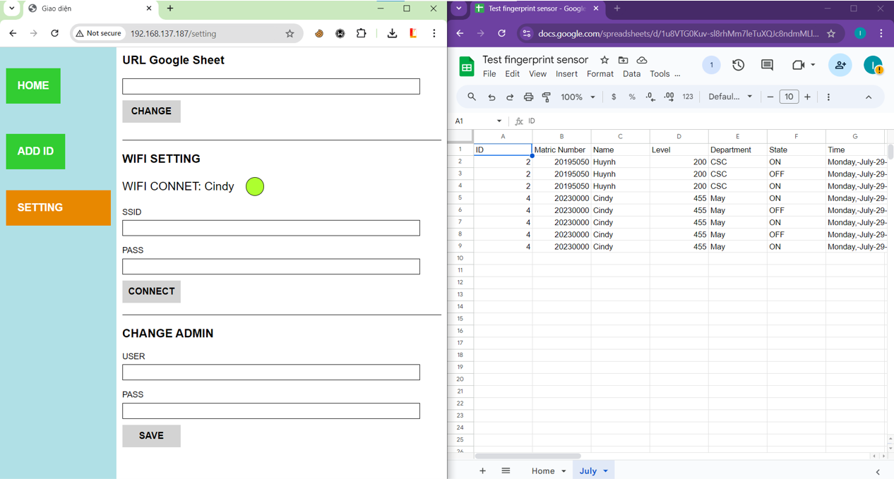

# ESP32_Fingerprint_Sensor_AS608_Google_Sheet
The real-time attendance device is built based on the esp32 microcontroller.

## DEVICE HARDWARE
List of devices

|Device|Number|
|:---------------|:-------:|
|Esp Dev Kit|1|
|AS608|1|
|LCD16x2 I2C|1|
|Led RGB|1|
|Buzzer|1|

#### Peripheral connection diagram for Esp32

## INSTALL
### 1. Install ArduinoIDE
[Arduino IDE 1.8.19](lib/arduino-1.8.19-windows.exe)

### 2. Install Library
#### 2.1 Install library for Webserver

In Arduino IDE > Sketch > Include Library > Add ZIP Library\
[ESPAsyncWebServer-master.zip](lib/ESPAsyncWebServer-master.zip)\
[AsyncTCP-master.zip](lib/AsyncTCP-master.zip)

In Arduino IDE > Sketch > Include Library > Manager Libraries\
WiFi.h\
Adafruit_Fingerprint.h\
Preferences.h\
ESPAsyncWebServer.h\
SPIFFS.h\
LiquidCrystal_I2C.h\
HTTPClient.h\

### 2.2 Load code html for webserver in Esp32
### Install ESP32 Sketch Data Upload

Coppy Folder [tools](lib/tools) then paste to `C:\Users\HuYing\Documents\Arduino`

[Refer to the instructions](https://randomnerdtutorials.com/install-esp32-filesystem-uploader-arduino-ide/)

Arduino IDE > Tool
- Board : ESP32 Dev Module
- Pratiton
Arduino IDE > Tool > ESP32 Sketch Data Upload

## Setup google sheet
[Refer to the instructions](https://iotdesignpro.com/articles/esp32-data-logging-to-google-sheets-with-google-scripts)

Using code [here](sheet_scrip.js)

Copy the link to the google sheet [here](firmware/controller.h#L16)\
Copy the link to the google apps script sheet [here](firmware/controller.h#L17)
Change to your wifi in file [firmware/controller.h](firmware/controller.h#L14-15)

## Hardware
|Color|R|G|B|Status
|:-----|:--|:--|:--|:------------|
|Purple|1|0|1|Creat new id|
|Yellow|1|1|0|No internet|
|Cyan|0|1|1||
|Red|1|0|0|Erorr|
|Green|0|1|0|Cusseccfull|
|Blue|0|0|1|Available|

## Webserver

